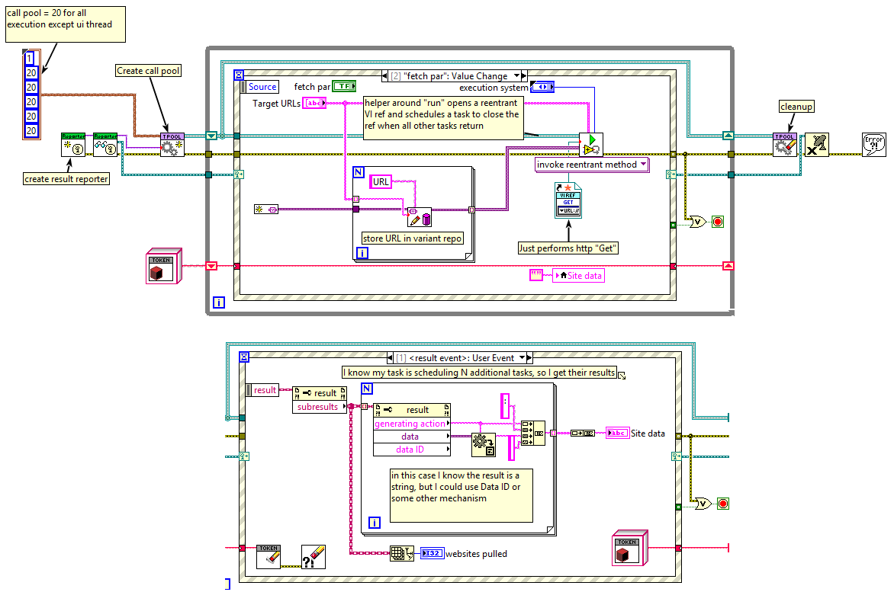

# taskpool

An API for scheduling "task" objects to run on any of the labview execution systems.

It consists of a few small classes which, to put it as simply as possible, work like so:

Starting in the main UI loop...
```
reporter=new result reporter
RegisterForEvents(reporter)
pool=new threadpool(reporter)
work=new task(myparameter)
pool.run(work)
(in background) task.perform()
(in background) result=task.RunDynamic()
(in background) task.reporter.report(result)
(in background) ...fire event reporter...
...event reporter fires...
```

In graphics, that looks like so:


The specific classes involved are:
- 'thread pool': creates an async call pool on any specified execution system (for example if you wanted to call a dll you could run it on "other 1" or something if you wanted) and allows you to run tasks on that call pool.
- Task: a unit of work. It can schedule other tasks if needed. The output of this work is a "result" object. The three tasks I wrote all operate on other tasks to make it easier to plug into. The three default tasks are "single function", "sequence", and "batch" (a task which schedules other "single action" tasks to run in parallel).
- Results reporter: a pipe for result objects. The example includes a "don't report", "event", and "queue" reporter, but you could do other things like sending an AMC message or actor message.
- Result: Generic container, includes a string ID and variant data, an error, and the ability to store child results.
- Cancellation token: A mechanism for sending a stop message to a task or action. Does not abort, instead it requires cooperation of the action/task.
